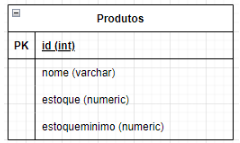

# Implementação de auditoria em um banco de dados de um sistema ERP para rastrear inclusões e alterações de produtos.

Atualmente, nosso ERP é utilizado por dezenas de clientes com alto nível de satisfação e, para que isso se mantenha, buscamos analisar constantemente as necessidades deles. Analisando as diversas demandas, verificamos que a criação de auditorias seria de muita importância, e a que desejamos criar primeiro é baseada em nosso cadastro de produtos — imagem a seguir. IMPORTANTE: o diagrama foi criado de forma resumida para facilitar o entendimento da atividade.

Para esta atividade, pede-se a leitura do estudo de caso para resolução do que se pede a seguir:

Para determinar as ações, nossa equipe de analistas trabalhou na estrutura de BD existente hoje e verificou que devemos executar as seguintes ações em nosso banco de dados:

1. Criar, na tabela de produtos, um campo para armazenar o usuário que realizou a inclusão do registro e outro para armazenar o usuário que realizou a última modificação.
2. Criar uma tabela “auditoriaproduto” com os campos: id, data/hora, ação realizada (inclusão ou alteração) e usuário.
3. Trigger na tabela de produtos que inclua o registro na tabela “auditoriaproduto” sempre que um novo produto for cadastrado.
4. Trigger na tabela de produtos que inclua o registro na tabela “auditoriaproduto” sempre que um produto for modificado.
5. Consulta que nos retorne as seguintes informações: id, nome, data/hora e usuário que fez a inclusão do produto, data/hora e usuário que realizou a última modificação do produto.

Para esta atividade, pede-se que seja feita a criação das estruturas acima solicitadas por nossos analistas de sistemas.